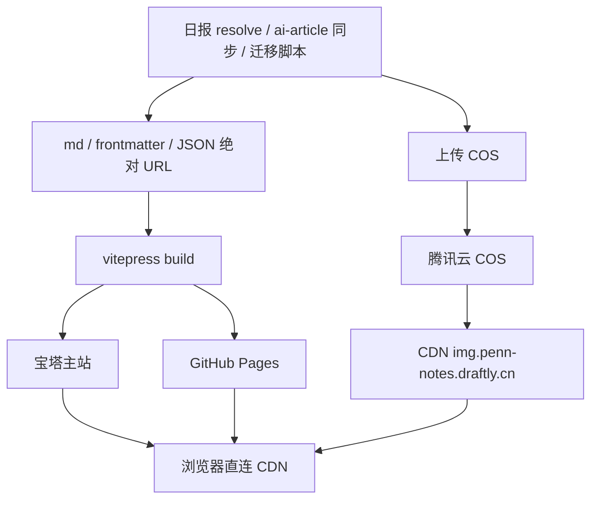

# 计划：文章配图全部迁移至 CDN / 对象存储

> 状态：**已完成**（阶段 B/C 落地；配图走 COS 源站域名，仓内不再跟踪文章图）  
> 更新日期：2026-09-07  
> 范围：一期迁走 **全部文章配图**（AI 动态 + 笔记封面 + 旧笔记插图）。  
> 背景：双托管后 Checkout / SCP 被约 **110MB+** 图片拖慢。配图上 COS，仓库与 dist 只留 HTML/CSS/JS 与站点图标。  
>
> **访问方式定稿（2026-08-26）：** 使用 COS **自定义源站域名**（不经 CDN 加速）。  
> - 桶：`penn-notes-img-1300329311`（广州 `ap-guangzhou`）  
> - 域名：`https://img.penn-notes.draftly.cn`  
> - DNS：主机记录 `img.penn-notes` → CNAME → `penn-notes-img-1300329311.cos.ap-guangzhou.myqcloud.com`  
> - 验收：`https://img.penn-notes.draftly.cn/test.png` 已可打开  
> - 说明：经典 CDN 曾出现回源 502 / 连接中断；源站域名已够用。以后若要加速可再挂 CDN，`COS_CDN_BASE` 不用改。

---

## 1. 目标

| 目标 | 说明 |
|------|------|
| 缩小仓库与构建产物 | 文章配图不再进 git；dist 不再打包大图 |
| 加快 CI / 宝塔部署 | Checkout、同步主要只剩代码与小体积站点资源 |
| 读图稳定 | 新闻继续「og:image → 可控存储」；封面 / 插图同源 CDN |
| 双端一致 | 主站与 GitHub Pages 共用同一套 **绝对 CDN URL** |

本期迁出（文章配图）：

| 类型 | 旧路径前缀 | COS 对象键前缀 |
|------|------------|----------------|
| AI 动态配图 | `/news/YYYY-MM/…` | `news/YYYY-MM/…` |
| 笔记封面 | `/sync/<id>/…` | `sync/<id>/…` |
| 旧笔记插图 | `/img/legacy/…` | `img/legacy/…` |

本期**不迁**（站点资源，体积很小）：

- `website/public/img/logo.svg`、favicon、`pn-favicon-32.png`、`img/pn-apple-touch.png` 等品牌 / 图标
- RSS `feed.xml`、非图片静态文件

---

## 2. 现状（迁移后）

文章配图已在 COS，正文 / 卡片 / frontmatter 使用 **绝对 URL**  
`https://img.penn-notes.draftly.cn/{news|sync|img/legacy}/…`。  
`website/public/` 下 **不再** 存放新闻图、封面、legacy 插图（已从 git 移除）；仅保留 logo / favicon 等站点图标。

| 类型 | 线上引用 | 说明 |
|------|----------|------|
| AI 动态配图 | `https://img.…/news/YYYY-MM/<hash>.*` | `resolve-news-images.mjs` 上传后写回 md |
| 笔记封面 | `https://img.…/sync/<id>/cover.jpg` | ingest / 同步路径上传 COS |
| 旧笔记插图 | `https://img.…/img/legacy/…` | 历史迁移已改写 |
| 站点图标等 | `/img/logo.svg`、favicon 等（随 `PENN_BASE`） | 仍进仓、随站点部署 |

### 2.1 各流水线怎么写入

**AI 动态**（`docs/NEWS.md`）

1. 摘要 → `news/YYYY-MM/ai-news-*.md`
2. `resolve-news-images.mjs` → 临时下载 → 上传 COS → md 写 `${COS_CDN_BASE}/news/…`
3. `sync:news` / `build:home` 卡片 `image` 同为绝对 CDN URL

**笔记封面**（`docs/SYNC.md`）

1. ai-article 同步写入正文；封面经 COS 上传
2. frontmatter：`cover: https://img.…/sync/<id>/cover.jpg`
3. 正文：``
4. `build-home` 的 `publicAssetSrc()`：`https://` 原样输出；若仍有相对 `/sync/…` 会按 Vite `base` 处理（应尽快改成 CDN 绝对 URL）

**旧笔记插图**

1. 已迁 COS；正文为 CDN 绝对 URL
2. 无日常下载流水线；漏网可用 `npm run cos:migrate` / Actions「COS migrate images」补跑

### 2.2 已解决的痛点

- 仓与 dist 不再被 ~110MB 配图拖慢
- 宝塔 Runner Checkout / 部署以代码为主
- 主站 / Pages 共用同一套 CDN URL，无需双份静态图

---

## 3. 方案：腾讯云 COS + CDN（已锁定）

### 3.1 架构



### 3.2 资源规划

| 项 | 值 |
|----|-----|
| 存储桶 | `penn-notes-img-1300329311`（广州 `ap-guangzhou`） |
| 公网访问 | COS **自定义源站域名** `https://img.penn-notes.draftly.cn`（一期不经 CDN） |
| DNS | 主机 `img.penn-notes` → CNAME → `penn-notes-img-1300329311.cos.ap-guangzhou.myqcloud.com` |
| 对象键 | 保持现有语义：`news/…`、`sync/…`、`img/legacy/…` |
| ACL | 桶公有读私有写；禁止列桶 |
| HTTPS | 源站域名绑定证书 + 强制 HTTPS（已验收） |
| CDN | 一期不用；经典 CDN 曾 502/连不上，以后可再叠加 |

**封面注意：** 若 ai-article 会用同一 `cover.jpg` 覆盖更新，勿对 `sync/**` 设「immutable」过长。

### 3.3 Secrets

| Secret | 用途 |
|--------|------|
| `COS_SECRET_ID` / `COS_SECRET_KEY` | API 密钥 |
| `COS_BUCKET` / `COS_REGION` | 桶与地域 |
| `COS_CDN_BASE` | 如 `https://img.penn-notes.draftly.cn`（无尾斜杠） |

本地 `.env` 不进仓。子账号：该桶 `PutObject` / `HeadObject`（可选 `DeleteObject`）。

### 3.4 降级（已锁定）

- **新闻新图：** Secrets 缺失或上传失败 → 该条不插图 + 日志；**不**写回 `public/news`
- **封面同步：** 上传失败 → 同步任务失败或明确告警（封面是文章硬依赖，优先失败可见，避免静默无封面）
- **历史迁移：** 上传失败则保留该条本地路径，不删对应 git 文件，跑完再重试

---

## 4. 代码改造范围

### 4.1 新闻：`scripts/resolve-news-images.mjs`

- 临时下载 → 上传 COS → 删临时文件
- md 写 `${COS_CDN_BASE}/news/...`
- CDN URL 幂等跳过；本地路径且 COS 已有则只改写链接

### 4.2 封面：ai-article 同步路径

- 同步写入封面时：上传 COS，frontmatter / 正文 `src` 改为 `${COS_CDN_BASE}/sync/<id>/…`
- 涉及约定见 `docs/SYNC.md`；若封面由外部仓库推送，需在**接收侧**（本仓 ingest / CI）或**推送侧**改写——实施时以当前 `blog-sync` / ingest 实际落点为准，统一走 `scripts/cos-upload.mjs`
- `publicAssetSrc` / 主题组件：确保 `https://` 封面不经 Vite 当模块解析（已有 absolute URL 分支则保持）

### 4.3 历史插图 + 统一迁移脚本

- `scripts/migrate-article-images-to-cos.mjs`（或分模块）：
  1. 扫描并上传 `public/news/**`、`public/sync/**`、`public/img/legacy/**`
  2. 改写 `news/**/*.md`、`website/**/*.md`（含 sync 稿）中的 `/news/`、`/sync/`、`/img/legacy/` → CDN 绝对 URL
  3. 不改写站点 logo / favicon 路径

### 4.4 Git / 忽略

`.gitignore` 增加（示例）：

```
website/public/news/**/*.{jpg,jpeg,png,gif,webp,avif}
website/public/sync/**/*
website/public/img/legacy/**
```

保留 `feed.xml`、logo、favicon 等。阶段 C 从 git 移除已跟踪二进制。

### 4.5 CI / 文档

- `daily-news.yml`：COS Secrets
- 封面同步相关 workflow（若有）：同样注入
- `ci.yml`：产物应变轻
- 更新 `docs/NEWS.md`、`docs/SYNC.md`、`README.MD`

### 4.6 公共封装

- `scripts/cos-upload.mjs`：Put / Head / 拼 CDN URL
- `scripts/cos-health.mjs`：抽查三类前缀 URL 是否 200

---

## 5. 实施阶段

| 阶段 | 内容 | 状态 |
|------|------|------|
| A | COS + 源站域名 + Secrets | 完成 |
| B | 增量：新日报 / 新封面走 CDN | 完成 |
| C | 历史全量迁移 + 从 git 移除配图 | 完成 |
| D | 文档收尾 | 进行中（本文已按「迁移后」改写） |

补跑迁移：Actions → **COS migrate images**，或本地 `npm run cos:migrate`（需 `.env` 中 `COS_*`）。

---

## 6. 风险

| 风险 | 应对 |
|------|------|
| 漏改写某条 `/sync/` 或 legacy | 迁移脚本扫全仓 md；health 抽查 + 站内搜相对路径 |
| Vite 误解析路径 | 文章图一律绝对 `https://`；勿写带 base 的 `/penn-notes/sync/…` |
| 封面同名覆盖 | sync 对象缓存策略勿盲目 immutable；或覆盖后刷新 CDN |
| Secrets / 上传失败 | 新闻跳过；封面失败可见；迁移保留本地重试 |
| 先删 git 后上传失败 | 禁止；必须先 CDN 稳定再 `git rm` |
| 防盗链误伤 Pages | 白名单或一期关闭 |

---

## 7. 成功指标

- 新日报 / 新同步稿不再向 git 提交文章配图二进制  
- `website/public/news`、`public/sync`、`public/img/legacy` 不再作为发布内容来源  
- 主站与 Pages 文章图均走 CDN  
- clone / 宝塔部署明显快于迁移前（去掉 ~110MB 配图）  

---

## 8. 决策记录

| 项 | 决定 |
|----|------|
| 存储 | 腾讯云 COS + CDN |
| 域名 | `img.penn-notes.draftly.cn`（可用默认域名先验） |
| **范围** | **一期迁全部文章配图：news + sync + img/legacy** |
| 保留在仓 | logo、favicon、apple-touch 等站点图标 |
| 新闻降级 | 失败 → 无图跳过 |
| 封面降级 | 失败 → 任务失败/告警（可见） |
| 历史 | 一期做完阶段 C |

---

## 9. 相关文件

- [`scripts/resolve-news-images.mjs`](scripts/resolve-news-images.mjs)  
- ai-article / ingest 封面落点（见 [`docs/SYNC.md`](docs/SYNC.md)）  
- [`scripts/build-home.mjs`](scripts/build-home.mjs)（`publicAssetSrc`）  
- [`.github/workflows/daily-news.yml`](.github/workflows/daily-news.yml)  
- [`.gitignore`](.gitignore)  
- [`docs/NEWS.md`](docs/NEWS.md)、[`docs/SYNC.md`](docs/SYNC.md)、[`README.MD`](README.MD)  
- （新建）`scripts/cos-upload.mjs`、`scripts/migrate-article-images-to-cos.mjs`、可选 `cos-health.mjs`  

本文档：[`CDN-IMAGES-PLAN.md`](CDN-IMAGES-PLAN.md)。
